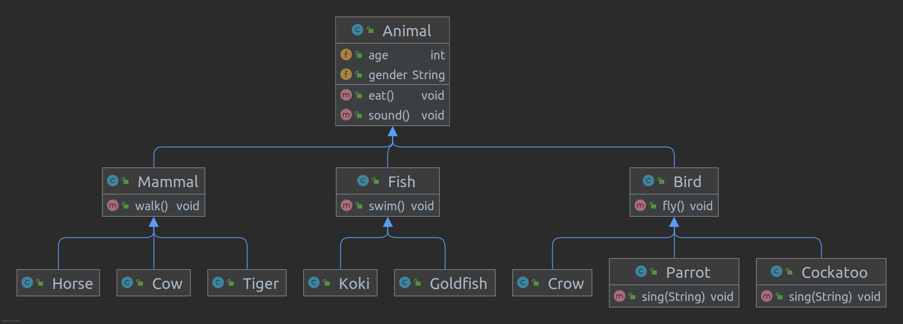

---
output:
  pdf_document: default
  html_document: default
---
Struktur Data - Tugas 1
=======================

**Nama :** **Tito Pandu Brahmanto**

**NIM :** **042065142**

## Soal No 1

Dalam suatu SPBU atau Pom Bensin terdapat 3 tempat pengisian bahan bakar yang masing-masing berisi premium, pertalite, dan solar. Di tempat itu terdapat 15 kendaraan yang akan mengisi bahan bakar dengan rincian sebagai berikut:

1. 5 mobil menggunakan bahan bakar premium
2. 5 mobil menggunakan bahan bakar pertalite
3. 5 mobil menggunakan bahan bakar solar

Simulasikan kasus di atas secara bertahap dengan menggunakan konsep queue, stack, atau deque. Pilih minimal 2 konsep, kemudian jelaskan secara simulasi dari konsep tersebut dengan jelas.

### Jawab:

Konsep yang cocok diimplementasikan adalah konsep queue dan deque.

Untuk konsep queue, setiap tempat pengisian bahan bakar ada 5 mobil yang mengantri. Antrian mobil menggunakan konsep queue yang menganut FIFO (First In First Out). Pada kasus ini, kita memiliki 3 queue yang di tempatkan di depan setiap tempat pengisian bahan bakar. Berikut simulasi kasusnya

1. 1 mobil premium datang dan masuk ke queue premium `[a]`
2. 1 mobil tersebut dilayani oleh tempat pengisian premium `[]` -> a
3. 1 mobil premium, 2 mobil pertalite dan 3 mobil solar datang dan masuk ke masing-masing queue. Queue premium `[b]`, queue pertalite `[f,g]`, queue solar `[k, l, m]`
4. Tempat pengisian pertalite dan solar melayani masing-masing 1 mobil dari queue-nya. Queue premium `[b]`, queue pertalite `[g]` -> f, queue solar `[l, m]` -> k
5. 3 mobil premium, 2 mobil pertalite dan 2 mobil solar datang dan masuk ke masing-masing queue. Queue premium `[b, c, d, e]`, queue pertalite `[g, h, i]`, queue solar `[l, m, n, o]`
6. Setiap tempat pengisian bahan bakar selesai melayani mobil pertama dan melanjutkan melayani mobil kedua dari tiap-tiap queue. Queue premium `[c, d, e]` -> b, queue pertalite `[h, i]` -> g, queue solar `[m, n, o]` -> l
7. 1 mobil pertalite datang. Queue pertalite `[h, I, j]`
8. Setiap tempat pengisian bahan bakar selesai melayani mobil kedua dan melanjutkan melayani mobil ketiga dari tiap-tiap queue. Queue premium `[d, e]` -> c, queue pertalite `[i, j]` -> h, queue solar `[n, o]` -> m
9. Tempat pengisian premium selesai melayani mobil ketiga dan melanjutkan melayani mobil keempat. Queue premium `[e]` -> d
10. Tempat pengisian pertalite dan solar selesai melayani mobil ketiga dan melanjutkan melayani mobil keempat. Queue pertalite `[j]` -> i, queue solar `[o]` -> n
11. Setiap tempat pengisian bahan bakar selesai melayani mobil keempat dan melanjutkan melayani mobil kelima dari tiap-tiap queue. Queue premium `[]` -> e, queue pertalite `[]` -> j, queue solar `[]` -> o

Untuk konsep deque, sebenarnya sama dengan konsep queue, yaitu FIFO (First In First Out). Namun deque memiliki kelebihan di mana interface-nya juga membolehkan mengambil antrian yang masuk terakhir (LIFO atau Last In First Out). Dalam simulasi, salah satu mobil bisa berpindah ke antrian yang lain (misal mobil premium bisa pindah ke pertalite). Berikut simulasi kasusnya.

1. 1 mobil premium datang dan masuk ke deque premium `[a]`
2. 1 mobil tersebut dilayani oleh tempat pengisian premium `[]` -> a
3. 1 mobil premium, 2 mobil pertalite dan 3 mobil solar datang dan masuk ke masing-masing deque. Deque premium `[b]`, deque pertalite `[f,g]`, deque solar `[k, l, m]`
4. Tempat pengisian pertalite dan solar melayani masing-masing 1 mobil dari deque-nya. Deque premium `[b]`, deque pertalite `[g]` -> f, deque solar `[l, m]` -> k
5. 3 mobil premium, 2 mobil pertalite dan 2 mobil solar datang dan masuk ke masing-masing deque. Deque premium `[b, c, d, e]`, deque pertalite `[g, h, i]`, deque solar `[l, m, n, o]`
6. Setiap tempat pengisian bahan bakar selesai melayani mobil pertama dan melanjutkan melayani mobil kedua dari tiap-tiap deque. Deque premium `[c, d, e]` -> b, deque pertalite `[h, i]` -> g, deque solar `[m, n, o]` -> l
7. __*1 mobil premium terakhir (e) memutuskan untuk pindah ke antrian pertalite. Deque premium `[c,d]` -> e, deque pertalite `[h, I, e]` <- e (deque bisa mengambil elemen terakhir untuk dipindahkan ke deque lain).*__
8. 1 mobil pertalite datang. Deque pertalite `[h, i, e, j]`
9. Setiap tempat pengisian bahan bakar selesai melayani mobil kedua dan melanjutkan melayani mobil ketiga dari tiap-tiap deque. Deque premium `[d]` -> c, deque pertalite `[i, e, j]` -> h, deque solar `[n, o]` -> m
10. Tempat pengisian premium selesai melayani mobil ketiga dan melanjutkan melayani mobil keempat. Deque premium `[]` -> d
11. Tempat pengisian pertalite dan solar selesai melayani mobil ketiga dan melanjutkan melayani mobil keempat. Deque pertalite `[e, j]` -> i, deque solar `[o]` -> n
12. __*1 mobil pertalite terakhir (j) memutuskan pindah ke antrian premium karena kosong. Deque pertalite `[e]` -> j, deque premium `[j]` <- j*__
13. Setiap tempat pengisian bahan bakar selesai melayani mobil keempat dan melanjutkan melayani mobil kelima dari tiap-tiap deque. Deque premium `[]` -> j, deque pertalite `[]` -> e, deque solar `[]` -> o

Line yang di-underline menunjukan perbedaan deque.

## Soal No 2

Dalam sebuah kebun binanang, terdapat banyak jenis hewan diantaranya sapi, harimau, kuda, gagak, kakak tua, beo, ikan lele, ikan koki, dan ikan mas. Gambarkan/Ilustrasikan yang disertai penjelasan oleh Anda, supaya dapat diterapkan kedalam bahasa pemograman java berupa class, anak class, object, dan method. 

### Jawab



Dalam diagram di atas saya membuat class (parent) `Animal`, yang memiliki tiga child class yaitu `Bird`, `Fish` dan `Mammal`. Masing-masing child class ini memiliki child class juga berupa jenis binatang yang disebutkan di soal (`Crow`, `Cockatoo`, `Parrot`, `Koki`, `Goldfish`, `Tiger`, `Cow` dan `Horse`).

Class `Animal`, karena mewakili semua binatang di kebun binatang, memiliki field `age` (menandakan umur) dan `gender` (menandakan jenis kelamin). Juga memiliki method `eat` dan `sound`.

Child class dari `Animal`, yaitu `Mammal`, `Fish` dan `Bird` memiliki method yang berbeda karena cara mereka bergerak berbeda, yaitu `walk` (untuk `Mammal`), `swim` (untuk `Fish`) dan `fly` (untuk `Bird`).

Child class dari `Mammal` dan `Fish` tidak memiliki method tambahan (hanya inherit). Child class dari `Bird`, yaiu `Parrot` dan `Cockatoo` memiliki method tambahan `sing`.

Object dari susunan class ini adalah setiap binatang yang ada di kebun binatang. Misalnya di kebun binatang ada 4 kuda, maka individual kuda disebut object dari class Horse. Karena object merupakan instance dari class yang dibuat saat akan digunakan (dilahirkan).

Sedangkan Method adalah fungsi yang didefinisikan di class dan dapat dipanggil baik melalui class (static) atau object. 

## Soal No 3

Dalam bahasa pemograman Java terdapat tipe-tipe data primitif. Sebutkan dan jelaskan tipe-tipe data tersebut yang disertai dengan contoh penerapan deklarasi dalam pemograman Java.

### Jawab:

### Null

Nilai bertipe data null dapat dimiliki oleh variabel baik bertipe integer, boolean, string, dan lainnya. Null merupakan simbol kosong yang artinya variabel tersebut belum diisi. Cara penulisan deklarasinya, berikut:

```java
Integer result = null;
String combination = null;
Boolean isRead = null;
Float someNumber = null;
Character symbol = null;
```

### Boolean

Tipe data boolean hanya dapat diisi dengan nilai benar atau salah (true atau false). Berikut penulisan deklarasinya.

```java
boolean isRead;
boolean isRead = true;
boolean isRead = false;
```

### Integer

Tipe data integer berisi bilangan bulat. Tipe data int 32-bit mempunyai rentang nilai -2<sup>31</sup> sampai 2<sup>31</sup>. Sedangkan untuk 64-bit adalah tipe data long integer yang di akhir penulisan variabelnya ditambahkan tanda L atau l. Berikut penulisan deklarasinya.

```java
int duration = 60;
long volume = 30L;
```

### Floating Point

Tipe data floating point bertipe 64-bit untuk double dan bertipe 32-bit untuk float. Kedua tipe data tersebut merupakan bilangan riil. Untuk menuliskan tipe data float, di akhir angka diberikan huruf F atau f. Berikut penulisan deklarasinya.

```java
double completionRate = 0.5;
float velocity = 10.675F;
```

### Character

Tipe data character bertipe 16-bit dan merupakan karakter unicode, sehingga ada kaitannya dengan kode ASCII. Berikut penulisan deklarasinya.

```java
char firstCharacter = 'B';
char secondCharacter = '\u0042';
char thirdCharacter = 66;
```

### String

Tipe data string merupakan sebuah kalimat. Syarat dari suatu string harus ditulis di antara dua tanda petik, kemudian dalam menuliskan tipe data string, maka huruf S dalam kata string harus huruf besar, seperti `String`. Berikut penulisan deklarasinya.

```java
String sentence = "Hello, World!";
String title = "BMP Struktur Data (MSIM4202)";
```

#### Sumber:

* BMP Struktur Data MSIM4202