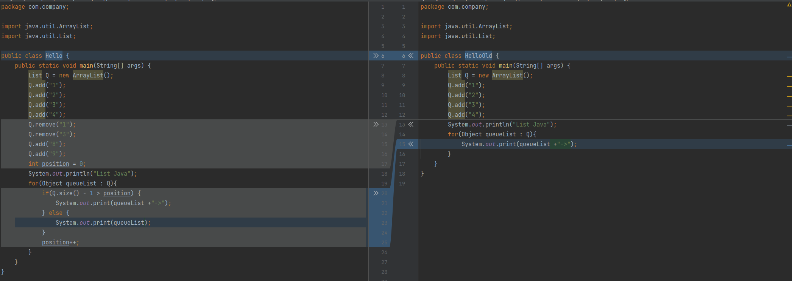

---
output:
  pdf_document: default
  html_document: default
---
Struktur Data - Tugas 2
=======================

**Nama :** **Tito Pandu Brahmanto**

**NIM :** **042065142**

## No 1

Untuk mengisi array dengan "H", "I", "U", berikut perintah-perintah yang digunakan.

```ruby
stack = []
stack.push("H")
stack.push("I")
stack.push("U")
stack
#=> ["H", "I", "U"]
```

Untuk merubah stack "H", "I", "U" menjadi "H", "A", "L", "O", "U", "T", berikut perintah-perintah yang digunakan.

```ruby
# Ruby
stack = ["H", "I", "U"]
temp_for_u = stack.pop
stack.pop
stack.push("A")
stack.push("L")
stack.push("O")
stack.push(temp_for_u)
stack.push("T")
stack
#=> ["H", "A", "L", "O", "U", "T"]
```

## No 2

Dalam sebuah antrian di bank, terdapat 20 orang nasabah yang datang ke customer service. Namun pada bank tersebut hanya terdapat 10 kursi antrian. Ilustrasikan oleh Anda pada sebuah array, bagaimana konsep queue terjadi jika:

1. Kondisi kursi penuh oleh 10 orang nasabah dan sisa 10 orang nasabah menunggu.

```ruby
# Ruby
antrian_kursi = []
antrian_berdiri = []
#mengisi antrian kursi dan berdisi
antrian_kursi.unshift(10, 9, 8, 7, 6, 5, 4, 3, 2, 1)
antrian_kursi
#=> [10, 9, 8, 7, 6, 5, 4, 3, 2, 1]
antrian_berdiri.unshift(20, 19, 18, 17, 16, 15, 14, 13, 12, 11)
antrian_berdiri
#=> [20, 19, 18, 17, 16, 15, 14, 13, 12, 11]
```

2. Kondisi kursi ketika 4 orang nasabah telah terlayani dan digantikan oleh nasabah berikutnya. 

```ruby
# Ruby
# `unshift` akan mengembalikan nilai array, cara kerjanya sama dengan `enqueue`
# sedangkan `pop` sama dengan `dequeue`
antrian_kursi.pop
antrian_kursi.unshift(antrian_berdiri.pop)
#=> [11, 10, 9, 8, 7, 6, 5, 4, 3, 2]
antrian_kursi.pop
antrian_kursi.unshift(antrian_berdiri.pop)
#=> [12, 11, 10, 9, 8, 7, 6, 5, 4, 3]
antrian_kursi.pop
antrian_kursi.unshift(antrian_berdiri.pop)
#=> [13, 12, 11, 10, 9, 8, 7, 6, 5, 4]
antrian_kursi.pop
antrian_kursi.unshift(antrian_berdiri.pop)
#=> [14, 13, 12, 11, 10, 9, 8, 7, 6, 5]
antrian_berdiri
#=> [20, 19, 18, 17, 16, 15]
```

## No 3

Di sini saya merubah println menjadi print agar output sesuai dengan permintaan 2->4->8->9

```java
import java.util.ArrayList;
import java.util.List;

public class Hello {
    public static void main(String[] args) {
        List Q = new ArrayList();
        Q.add("1");
        Q.add("2");
        Q.add("3");
        Q.add("4");
        Q.remove("1");
        Q.remove("3");
        Q.add("8");
        Q.add("9");
        int position = 0;
        System.out.println("List Java");
        for(Object queueList : Q){
            if(Q.size() - 1 > position) {
                System.out.print(queueList +"->");
            } else {
                System.out.print(queueList);
            }
            position++;
        }
    }
}
```

Dapat dilihat dalam diff, changes hanya berupa penambahan code (warna abu-abu).


