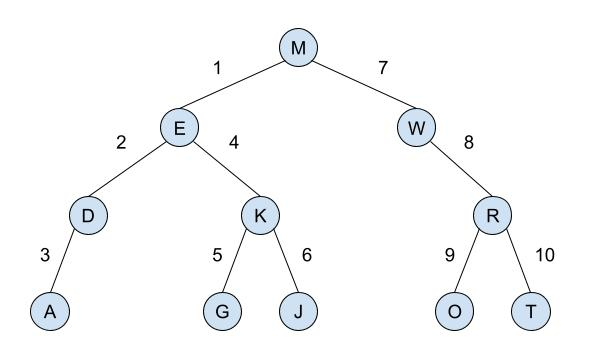
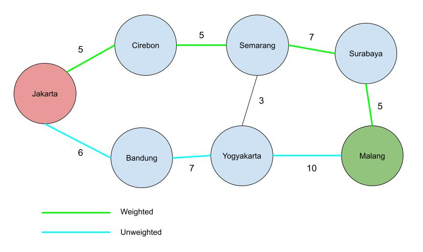

---
output:
  pdf_document: default
  html_document: default
---
Struktur Data - Tugas 3
=======================

**Nama :** **Tito Pandu Brahmanto**

**NIM :** **042065142**

## No 1

Preorder Traversal pada binary tree adalah jenis traversing yang melakukan kunjungan pertamanya terhadap node root, kemudia menuju node child sebelah kiri sampai node leaf paling kiri dari tree tersebut, sampai node leaf paling kanan pada node parent yang sama. Berikut ini Preorder Traversal untuk binary tree pada soal.

1. Tahap awal dari node root `M` menuju child sebelah kiri, yaitu node `E`.
2. Dari node `E` menuju child sebelah kiri, yaitu node `D`.
3. Dari node `D` menuju child sebelah kiri, yaitu node `A`.
4. Karena node `A` tidak memiliki child dan node `D` tidak memiliki child lain selain `A`, maka menuju node `K` yang bersebelahan dengan `D`.
5. Dari node `K` menuju child sebelah kiri, yaitu node `G`.
6. Karena node `G` tidak memiliki child maka menuju node `J`.
7. Karena node `J` tidak memiliki child maka kunjungan dilanjutkan ke node `W` yang bersebelahan dengan node `E`.
8. Dari node `W` menuju child sebelah kanan, yaitu node `R`.
9. Dari node `R` menuju child sebelah kiri, yaitu node `O`.
10. Karena node `O` tidak memiliki child maka menuju node `T`.

## No 2

1. Malang --> Surabaya --> Semarang --> Cirebon --> Jakarta => `5 + 7 + 5 + 5 = 22`
2. Malang --> Surabaya --> Semarang --> Yogyakarta --> Bandung --> Jakarta => `5 + 7 + 3 + 7 + 6 = 28`
3. Malang --> Yogyakarta --> Semarang --> Cirebon --> Jakarta => `10 + 3 + 5 + 5 = 23`
4. Malang --> Yogyakarta --> Bandung --> Jakarta => `10 + 7 + 6 = 23`

Shortest Path adalah sebagai berikut
* Weighted Shortest Path adalah menggunakan rute ke 1, yaitu Malang --> Surabaya --> Semarang --> Cirebon --> Jakarta dengan total weight 22. 
* Unweighted Shortest Path adalah menggunakan rute ke 4, yaitu Malang --> Yogyakarta --> Bandung --> Jakarta 

